# Intro
- data structures store data
- algorithms solve problems using that data
- final is not cumulative

- if you print an object without a toString function it will print the memory address
- the no-parameter constructor is defined, but if you define one with parameters then it stops working and you have to write your own
- recall java arrays need to have all the same data types
- in a for loop
  - `i++` means the loop body will run with i and add the 1 after it finishes
  - `++i` means the loop body will run with i+1 immediately
- overriding: replacing methods from a parent class
- overloading: macing multiple of the same function with different functionality for different types/amounts of arguments

# Access Modifiers
the different types of access modifiers:
- a class can only be `public` or `package-private` (no modifier). 
  - `public` is visible to all other classes anywhere. 
  - no modifier is only visible to classes in the same package.
- members can be any of these:
  - `public` is visible to all other classes anywhere. 
  - no modifier is only visible to classes in the same package.
  - `private` can only be accessed in its own class 
  - `protected` can only be accessed within its own package AND by a subclass of its class, even if it is in a different package
| Modifier                          | Self | Other classes,<br>same pkg | Subclass,<br>same pkg | Subclass,<br>diff. pkg | Anywhere |
| --------------------------------- | ---- | -------------------------- | --------------------- | ---------------------- | -------- |
| `public`                          | Y    | Y                          | Y                     | Y                      | Y        |
| `protected`                       | Y    | Y                          | Y                     | N                      | N        |
| no modifier/<br>`package-private` | Y    | Y                          | N                     | N                      | N        |
| `private`                         | Y    | N                          | N                     | N                      | N        |
[oracle tutorial](https://docs.oracle.com/javase/tutorial/java/javaOO/accesscontrol.html)

- Java doesn't support restricting access by instance, only by class.
  - A class's methods are allowed to access private members of other objects of the same class. More precisely, a method of class C can access private members of C on objects of any subclass of C.
- having a `private`, `package-private`, or `protected` constructor means only code within the class can instantiate the class. 
  - this also means it cannot be subclassed unless the subclass is nested within the original class.

# Polymorphism
- because Java supports *derived/base class reference conversion*, when you reference a member of a subclass, you can treat it like a member of it's base class.
  - because of this, you can have an array made up of different objects, as long as they're in different subclasses of the same class
    - perhaps make an `ArrayList` of `Object`s and put basically anything besides literals in it
  - if you iterate along all of the objects and call a method that the base class has, the JVM will run the subclass's overridden version or, if they don't override it, will use the base class's version of it.
    - you must call a method defined in the base class the list was made for
## Mismatching Constructors
Here's an example:

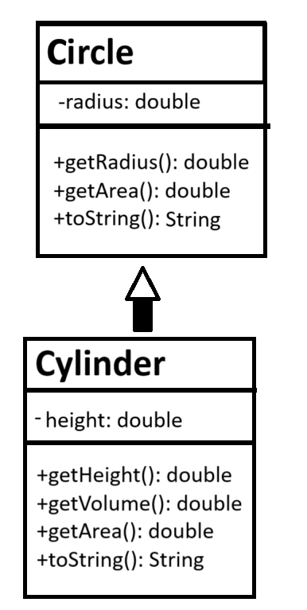

```java
public class main {
    public static void main(String[] args) {
        Circle c1 = new Cylinder(1.1,2.2); // base class object with derived class's constructor. diff. args, no error
        System.out.println(c1.getRadius()); // ok because cylinder's constructor sets radius.
        c1.getHeight(); // Exception thrown. Circle has no method getHeight().
        c1.getVolume(); // Exception thrown. Circle has no method getVolume().
        System.out.println(c1.toString()); // uses Cylinder's toString(), overridden from Circle's.
        System.out.println(c1.getArea()); // uses Cylinder's getArea(), overridden from Circle's.

        Cylinder c2 = new Circle(2.2); // Exception thrown. cannot convert. die.
        
    }
}
```
- this specific type of object can use only methods defined by the base class `Circle`. 
- if you try to call a method that *only* `Cylinder` has, an Exception is thrown.
- `c1` will use `Cylinder`'s methods iff it overrides them; otherwise it will use `Circle`'s definition.
- you cannot instantiate a derived class using the constructor of the base class.

# Types of classes
## Abstract classes
- an `abstract` method is not implemented in the base class -- all derived classes must override the function.
  - precedes the method signature: `abstract double computeArea(){...}`
    - you can't also put an access modifier because it cannot be used anyway
  - any class with an abstract method must be abstract, but abstract class can contain both abstract and concrete methods.
- an `abstract` class cannot be instantiated, but is strictly a superclass that specifies how its subclass/es must be implemented.
  - `public abstract class Shape {`
  - can have regular and abstract methods. derived classes need not override concrete functions (but they can).
  - can have a constructor, even if it can't be instantiated
- a concrete class is a regular class
  - if a concrete class doesn't override an abstract method from its base class, it cannot be instantiated.

## Interfaces
- like an abstract class but ***only*** contains abstract methods and `static final` fields
  - because they only contain abstract methods you don't actually need to include  `abstract` in their signatures
  - this means you can specify access modifiers for its abstract methods
- defined: `public interface MyInterface {...}`
- inherited with `implements` rather than `extends`
- you can *implement* as many interfaces as you want with a comma-separated list: `public class Square implements Shape, DisplayObject,  {...}`
- cannot include a constructor


# is-a / has-a
- is-a: a member of a derived class IS-A member of its base class.
  - child IS-A person.
- has-a: an object HAS-A instance variable.
  - child HAS-A birth date.

## UML outline
Unified Modeling language

regular concrete class:
| ClassName                                                                                     |
| --------------------------------------------------------------------------------------------- |
| -privateDataMember: Type<br>+publicDataMember: Type<br>#protectedDataMember: Type             |
| -privateMethod(): ReturnType<br>+publicMethod(): ReturnType<br>#protectedMethod(): ReturnType |
UML class diagram:

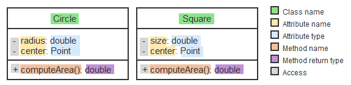

- strictly a structural diagram, not behavioral
  - simplified versions showing just class names may be used for illustrative purposes
- A solid line with a closed, unfilled arrowhead indicates a class is derived from another class.
- the derived class only shows new members
- an abstract class's name and abstract methods must be *italicized*
  - its derived classes should include the method, in regular font, now that it is concrete

  
- interfaces are denoted by putting `<<interface>>` on top of their name
  - all regular type
  - any classes that inherit it point a dashed line with an unfilled arrow at it.
    - also just repeat all of the interface's methods in the derived class bc now they're concrete

# List ADT
- the basic concept of a List in programming
- the point of this data type is that the implementation is unknown
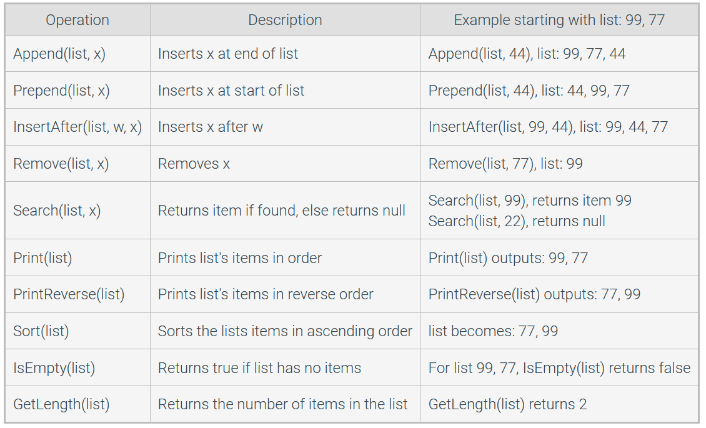
- singly-linked lists are where each node (i.e. element/cell) links to the one in front of and behind it, and no others.
  - if something points to *null*, it is pointing to nothing.
- the head node is the first one. awesome.
- the tail node is the last one.
## ListRemoveAfter
- `ListRemoveAfter(list, null)`: trying to remove the node after `null` node removes the head of the list instead.
- `ListRemoveAfter` will set `sucNode` to whatever node comes after the node being removed
## idk what this notation is called
- list⇢head = 9 assigns 9 as the head of the list, replacing the original.
- list⇢tail = 9 sets 9 as the last node in the list, replacing the new one.
- list⇢tail⇢next = 9 assigns 9 as the new last node in the list, i.e. what comes after what was the last one
## Linked list search
- returns the first node from the list with he value you input, including its original pointer (even if it's null)
  - nodes visited = how many nodes come before the correct one *plus the correct one*
- if there is none, it returns null.
 - nodes visited = amount of nodes in the list

# Algorithm Efficiency

- further counter-clockwise = worse

- Linear growth rate: O(n)
  - increases in direct proportion to amount of inputs
- O(n * m)
  - for each element in n, we loop through all of m, thus n*m comparisons are being made.
- O(n + m)
  - iterating through n once and m once.
- effectively: nested loops = multiplication, consecutive loops = addition
  - adding a loop that runs a literal amount of times (not affected by list length) is still linear, O(n)
- quadratic growth rate O(n^2)
  - i.e., comparing each element in a list of every single other element in the list.
  - for each element, you check every other element. like n\*m, except it's just n\*n, thus n^2.
    ```java
    public static boolean areUnique(int[] x) {
      for(int i=0; i<x.length; i++) {
        for(int j=0; j<x.length; j++) {
          if (i != j && x[i] == x[j])
            return false;
        }
      }
      return true;
    }
    ```
    - optimize this by only checking through once -- if they are all equal or all not equal, you only need to check that equality once through.
- O(NlogN) - linearithmic or log-linear
  - e.g.:
  ```java
  public void MergeSort(int[] numbers, int i, int k) {
   int j = 0
   if (i < k) {
      j = (i + k) / 2              // Find midpoint 
      
      MergeSort(numbers, i, j)     // Sort left part
      MergeSort(numbers, j + 1, k) // Sort right part
      Merge(numbers, i, j, k)      // Merge parts
   }
  }
  ```
- given something strange like:
  ```java
  for(int i=1; i < x.length; i *= 2) {
    // Do something with x[i]
  }
  ```
  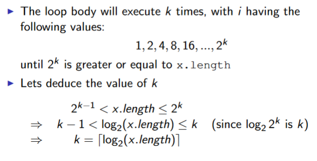

  - therefore complexity is T(log_2(n))
    - becomes O(log(n))
- more intense version:
  ```java
  for (int i = 0; i < n; i++) {
    for (int j = 0; j < n; j++) {
      // Simple Statement
    }
  }
  for (int i = 0; i < n; i++) {
    // Simple Statement 1
    // Simple Statement 2
    // Simple Statement 3
    // Simple Statement 4
    // Simple Statement 5
  }
  // Simple Statement 6
  // Simple Statement 7
  // ...
  // Simple Statement 30
  ```
  - this time is T(n) = n^2 + 5n + 25
    - one full iteration nested within another = n^2
    - one full iteration through 5 statements = 5n
    - 25 statements outside of a loop = 25
  - find O(n):
    - highest degree term of T(n) = n^2
    - if it had a coefficient we'd remove it
    - if there was a log we'd ignore its base
    - therefore O(n) = n^2
    - if it becomes just a constant it becomes O(1)
    - here's this too
      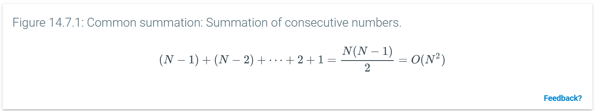
- some method f(n)'s complexity might be defined by upper bound (worst case) g(n) and lower bound (worst case) h(n)
- the growth rate = fastest-growing term of formula (highest degree)
  - n^2 + 5n + 25 --> O(n^2)
- c is the point where the upper bound diverges from O(n)
  - 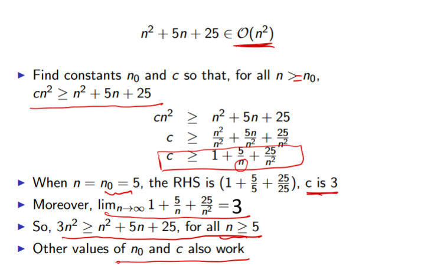


## Constant time operations
- addition, subtraction, multiplication, division
- assignment of a reference, pointer, other fixed data value
- comparison of two fixed-sized values
- reading from / writing to an array at a given index

# Generic Types
- instead of making a bunch of different versions of one method for every different data type, we can use generic classes.
```java
public static<E extends Comparable<E>> Pair<E> min_max(E[] array){
  // new method min_max. it's static, it needs to know we've named
  // the generic class E and it to be comparable.
  // it takes an array of like objects.
  // it will return a Pair with data members of that same type.

  //... i didn't get to write out the implementation
}
```

# Data Structures
# Array-based lists
- `List` interface:
  - sequence of elements with possible duplicates
  - fixed size
  - operations:
    - construct a new list
    - add an element at beginning, end, or specific index
      - `list.add("hi")` adds `"hi"` to the end
      - `list.add(2, "bye")` inserts `"bye"` at index 2
    - remove an element
      - removes given argument and shifts all following items back one
    - find an element in the list
    - check if list is empty
    - iterate over elements
  - the following structures implement the `List` interface
- `ArrayList`:
  - dynamic size
    - if we add capacity it will reallocate the memory, i.e. create a new `ArrayList` to do so
  - indexed
    - constant time to access elements
    - linear removal and insertion
- `LinkedList`:
  - dynamic size
  - not indexed
    - linear-time access
    - constant-time insertion
    - linear-time removal
- `Stack`:
  - push pop, peak, isEmpty. that's it 
    - peak does not affect the stack
    - java also has search to tell you where/if an object is in the stack
  - cannot remove from the middle/beginning, only the top
  - last in, first out
  - can only be created as empty in java
  - constant-time push/pop/peak

# Iterator class
- like using a for each loop except you can edit the items white you iterate
```java
while (iterator.hasNext()){
    String nextItem = iterator.next
    System.out.println(nextItem);
}
```

## Queue ADT
- new items go at the end and items are removed from the front
  - `add(element)` inserts an item at the end of the queue, exception if full
    - `offer(element)` adds an element to the end, false if full
  - `remove()` removes the item at the front of the queue, exception if null
    - `poll()` removes and returns it, null if already empty
  - `peek()` returns the first item without removing it, exception if null
    - `element()` returns the first item without removing it, null if empty
  - *isEmpty* returns true if there are no items in the queue
  - *getLength* int length
  - dequeue and peak might throw errors on an empty queue
- first-in-first-out
- can be implemented with a linked list or array
  - in the array implementation you can set which index in the array counts as the head and how long it is (which may exclude certain values in the array from the queue)
- bounded queue has a max length, i.e. can get full
- unbounded queue does not
- (frontIndex + length) % array.length = the index at which to place the new item for enqueue
- requires two pointers- head and tail
- Queue is an interface in java - not implemented
- using a circular array lets us add+remove in constant time
  - rear of a circular array = (current rear index + 1) % capacity
  - new items will be added at the rear index
  - we keep front index for reference
  - O(n) for reallocation
  - everything else is constant
- single-linked list, double-linked list, and circular array queues all have similar space complexity.

# Review
- 1: time complexity
  - polynomial time T(n)
  - O(n) is largest exponent of T(n)
  - exercise booklet 2 q1
  - easiest way to find is to trace
  - constant loop, inside is a loop from 0 to n but the step is j*2 ⟹ O(nlogn)
- SLL add/remove = linear
  - WITH reference to preceding node = linear
- understand how a queue works
  - no coding but tracing
  - remember commands
- same for stack: understand how it works + its commands but no coding question
- given `Node<E>` class and a linked list, make a LL like the original but with each element repeated `n` times
  ```java
  Node<E> repeat(Node<E> L, int n){
    if (head == null) return null;
    Node<E> head = L
    Node<E> result = new Node<E>(null);
    Node<E> dummy = result;
    while(L.head != null){
      for(i=1; i<=n; i++){
        result.next= new Node<E>(head);
        result = result.next;
      }
    head = head.next;
    result = result.next;
    }
    return dummy;
  }
  ```
  - i.e. L = [1,2,3], n = 3 ⟶ [1, 1, 1, 2, 2, 2, 3, 3, 3]
- remove tail:
```java
boolean removeTail(Node<E> L){
  Node<E> head = L;
  if (head==null) return false;
  if (head.next == null){
    L = null;
    return true;
  }
  current = head;
  while (current.next.next != null){
    current = current.next;
  }
  current.next = null;
  return true;
}
```
find if a string is palindrome, validate parentheses

# Binary Tree
- Recursive Data Structure
- general tree: a node can have any number of children
  - we can imagine a hierarchal file system as a general tree.
  - files and empty directories are leaves, folders are internal nodes
  - it needs to support a variable amount of children per node
- **binary tree**: any item has 0, 1, or 2 children
- all nodes have spaces for data and left and right children
  - nodes with no children are leaves
    - i.e. left and right children are null
- nodes with any (≥1) children are **internal nodes**
  - this includes the root
- children of the same parent are **siblings**
- any node above a node are its **ancestors**
- the link from a parent to child node is an **edge**
- A node's **depth** is the number of edges on the path from the root to the node. 
  - The root node thus has depth 0.
- All nodes with the same depth form a tree **level**.
- A tree's **height** is the largest depth of any node. 
  - A tree with just one node has height 0. 
- in a **balanced binary tree**
  - difference between the left and the right subtree for any node is not more than one
  - the left subtree is balanced
  - the right subtree is balanced
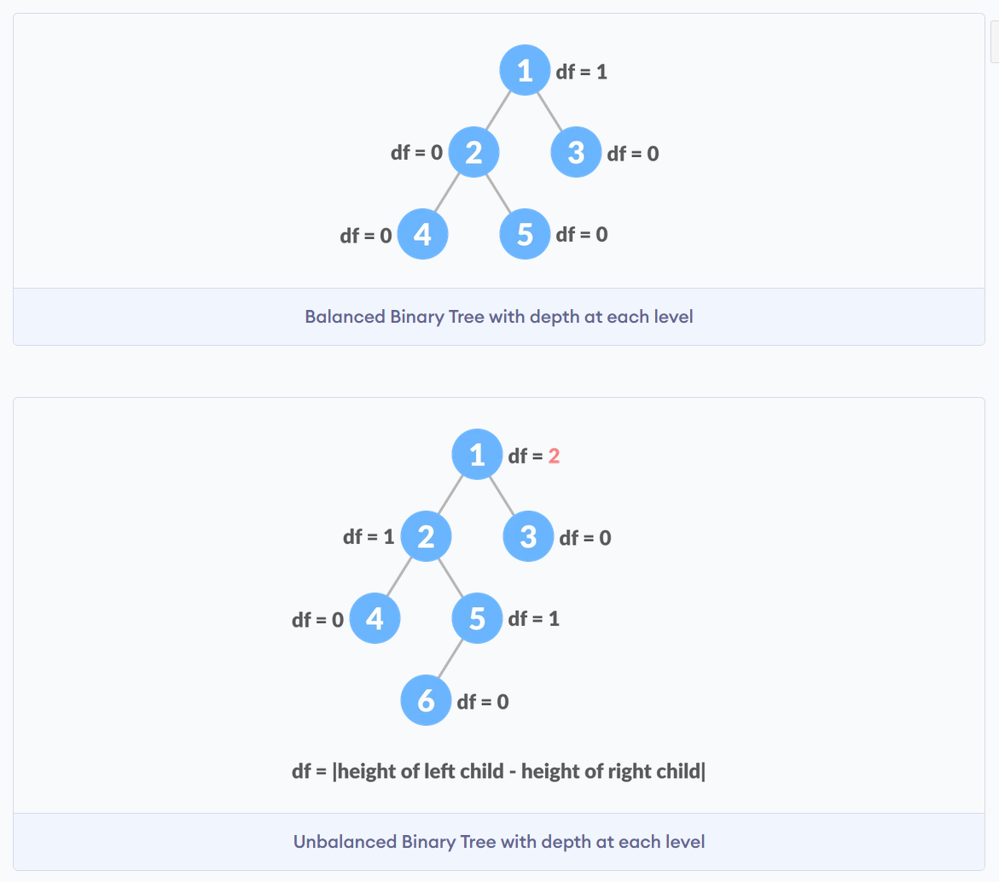
- in a **full binary tree**, there are no nodes with 1 child
  - all have either 2 or 0 children
- a **perfect binary tree** is 
  - a full binary tree where all leaves have the same depth
  - has exactly the maximum number of nodes
- a **complete binary tree** is 
  - a perfect binary tree until its second-to-last level
  - extra nodes at its lowest level are all toward the left
- examples:
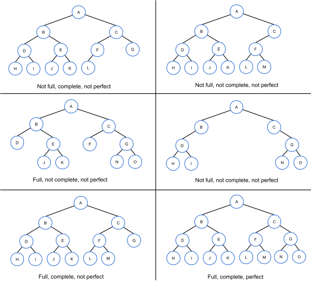
- the only reference (way to access the tree) is from the root (topmost parent node)

## Traversal
- inorder: L Root R
  - inorder(r.left)
  - print(r)
  - inorder(r.right)
- preorder: Root L R
  - print(r)
  - preorder(r.left)
  - preorder(r.right)
- postorder: L R Root
  - postorder(r.left)
  - postorder(r.right)
  - print(r)

## Binary Search Trees
- a binary tree with a specific ordering.
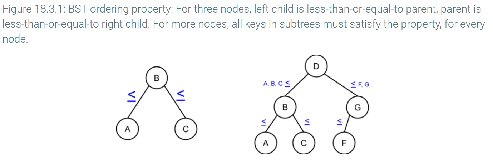
- in searching a BST you:
  - get the value of the node
  - compare it to the one you're searching for
  - if the value is < needed, go right; if the value is > needed, go left
  - repeat
  - if we find it, return true
  - if we ever reach a case where we get two leaves and x > L and x < R, return false
- searching a BST is O(H), H = the height of the BST.
  - the structure of the tree can highly affect its performance
  - we can minimize H by forcing all levels of the tree to be full, except possibly the lowest level (greatest depth)
  - for N nodes, H = floor(log₂ N)
  - therefore we can say the search for a perfect BST has O(logN)
    - much better than a list which has O(N)
  - the amount of *comparisons* required = H+1 = floor(log₂ N)+1
- inserting into a BST is also O(H).
  - inserting in a random order is actually the best ray to get a balanced tree
- each node in a BST has a predecessor and successor in the specific ordering (recall this is equivalent to putting them in a list in ascending value order)
  - 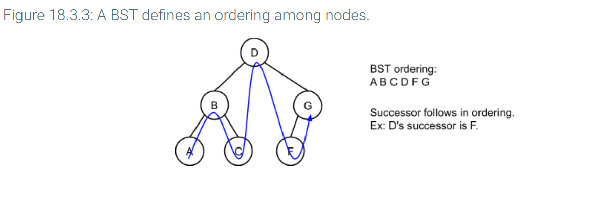
  - this looks like inorder traversal
- [deleting node n from BST](https://www.youtube.com/watch?v=DkOswl0k7s4)
  - when deleting a leaf node, just set the parent's pointer to null instead of n
  - if the node has 1 child, replace the parent's pointer to n with a pointer to n's child.
    - the child should be in the same pointer of the parent as n was, no matter which side n's child was on.
    - we can then safely delete n.
  - if n has two children, there are two options
    - take the minimum node from the right child's tree and replace n with it, then delete that original minimum node. this will be like deleting a leaf node.
    - take the  maximum node from the left child's tree and replace n with it, then delete that original maximum node. this will be like deleting a leaf node.
- finding the max of a BST = finding the rightmost child.
- finding the min of a BST = finding the leftmost child.

## Heaps
- A min-heap is a complete binary tree where
  - the root is the smallest value
  - every subtree is also a min-heap
- A max-heap is a complete binary tree where
  - the root is the largest value
  - every subtree is also a max-heap
- Height = floor(logN)
- When inserting, insert it into the lowest, leftmost spot in the tree and percolate it up (swap parent and new node) until it would break the x-heap property.
  - O(logN) = O(H)
- Removing the root node: replace it with the lowest-rightmost node and percolate down until it would break the principle.
  - in max-heap, swap new node with greatest child.
  - in min-heap, swap new node with least child.
  - this will usually also return the root node's value.
  - you'll never remove anything except the root node.
  - O(logN)
### Heaps as arrays
- Unlike a BST, they are turned into arrays just be reading through the tree.
  - 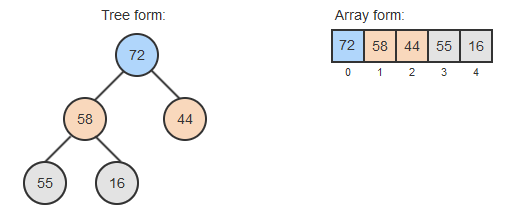
  - this only works because it has a strict structure
  - this needs to be an indexed array since parent/child info is not retained
- for node i, its parent is at floor((i-1)/2) and its children are at 2i+1 and 2i+2.
  - the parent node formula does not work on the root node.
  - the children nodes formula works for leaf nodes but it will be outside the bounds of the array.


## Treaps
- assuming we're dealing with a max-treap
- a BST that contains nodes with data (main keys) and randomly assigned "priority" keys (secondary keys) that also dictate its order
- search works like a regular BST search
- insert 
  - first places the node in BST order based on its data, then 
  - assigns it a random priority value and 
  - percolates it based on all nodes' priority
- therefore it should always be sorted by both data and priority
- as long as BST order is fulfilled, two siblings can have the same priority, as can a parent and child
  - a parent's priority must be ≥ that of its child
  - left/right children order is irrelevant for priority.
- to remove a node: set its priority to -∞, percolate it down to make it a leaf, and remove it from there.
  - percolating a node down uses ROTATIONS, not swaps, to preserve priority.
  - 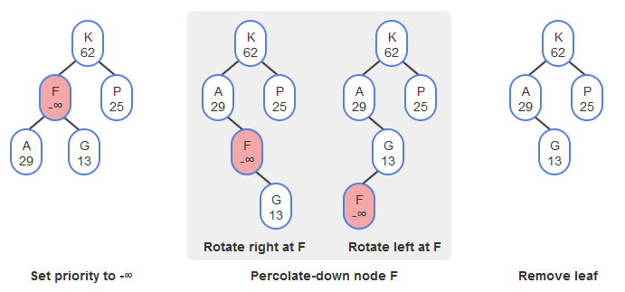


# Sorting algorithms
- these all sort in-place except for merge-sort
## Selection sort
- brute force algorithm
- looks through the list for the smallest number, and swaps index 0 with it
- then looks for the second-smallest and swaps index 1 with it
- this repeats until there are no more places to check.
- one swap occurs each iteration
- O(N²)
- indexSmallest will be assigned N-1 times
## Insertion Sort
- sorts the first two elements
- moves the 3rd back until it's in place
- moves the 4th back until it's in place
- repeats until there are no more items to move.
- O(N²)
  - or O(N) for sorted or nearly sorted lists (only one element out of place)
- e.g. 
- number of comparisons = (N-1)*(N/2)
  - only a single comparison is needed if the items are in order.
## Shell sort
- split the list into smaller interleaved lists by choosing each element k spaces apart
- sort each of the smaller lists with insertion sort
- then interleave them again and sort the full list with insertion sort.
- size-1 = (amount of smaller lists) * (gap size)
- amount of smaller lists = gap size
  - they might have different sizes
- gap size should be a power of 2 minus 1 except 0.
  - though you can use any number for gap size.
- it HAS to end with a ap of 1 to actually sort the whole thing
  - this gives us O(N^(3/2))
## Quicksort
- [check this guy out](https://www.youtube.com/watch?v=XE4VP_8Y0BU)
- chooses a pivot in the list
  - in every example i can find they chose the last item in the original list as the pivot
  - perhaps the first
  - ideally, you want the pivot to always be the midpoint of the list to split it up evenly in half
- typically O(NlogN) but worse case O(n²)
  - worse case = you keep choosing the smallest or largest item in the partition as the pivot
  - best case = you keep choosing the midpoint
- sorts the items > and ≤ the pivot separately
  - chooses a pivot in the smaller list
  - sorts the items greater and less than the pivot separately
    - etc.
  - put the ≤ sorted bit on the left of the pivot, the > bit on the right
  - keep doing that and the list is sorted
- until the whole thing is sorted
- if there are an odd amount of items the pivot idex is rounded down
- if there is one item in a partition it is sorted
- otherwise break it up and sort it again
- best case partitioning levels = log₂N
  - worst-case: n-1
- amount of comparisons = Nlog₂N
- midpoint = floor(lowIndex + (highIndex - lowIndex) / 2)
- pivot = item at midpoint index
## Merge Sort
- does not sort in-place; uses external storage
- splits lists into halves, sorts each half, and recombines and sorts them until we have a full list that's sorted
- for N elements there are log₂N partition levels

# Set interface
- member of the Collection hierarchy
- all elements in a set are unique
- sets are not indexed
- do not maintain insertion order
- efficient search and retrieval
  - we can use contains() for sets which runs quickly
- allow removal of elements without any shifting

# Map interface
- Map itself is not part of the collection hierarchy
- maps of keys to values
  - the collection of keys will be a Set
  - the values will be a Collection
- keys must be unique but values do not need to be
- more efficient than set in retrieval


# Hash Table
- a hash table stores items without order/index.
- searching, inserting and removing can all be O(n).
- the key should be completely unique, while its value does not need to be.
- the hash function determines where to store new values, i.e. which "buckets" to put them in.
  - for the amount of items n in the table, the hash function is input % n which will have indices 0 through n-1.
- collision: a new item is routed to a full bucket
  - chaining: when items collide, make the bucket into a list of everything routed to it
  - open addressing: putting the new item in some other empty bucket when the intended one is full
    - linear probing: keep looking for the closest empty bucket
      - the search algorithm will stop when it reaches an item that has never been full, since there is no way the item we're trying to find can be in the list if we haven't reached it by then
      - this will not affect insertion
    - quadratic probing: on collision, the new value is mapped to ((the original map) + c1\*i + c2\*i²) % tableSize with c1 and c2 given and i is how many collisions we've run into thus far.
- resizing the hashtable is O(n) because it has ot reallocate all of the items in it
- usually they are resized to the next prime number ≥ 2N
- load factor: total items / buckets
  - when this gets too big it might be time to resize the hashtable
- a perfect hash function maps all elements with no collisions, but it can only be made if we know all of the elements beforehand
  - this makes O(n) for everything
- a mid-square squares the key, extracts R digits from the result's middle, and returns the remainder of the middle digits divided by hash table size N.
  - stops keys from all mapping to the same buckets
- a multiplicative hash takes an initial value, repeatedly multiplies it by some (usually prime) number, and adds the ascii value of the next character in the string and takes that result mod table size N
  - initial value 5381 and multiplier 33 is quite good for short english strings
  - anagrams will map to the same bucket
- 